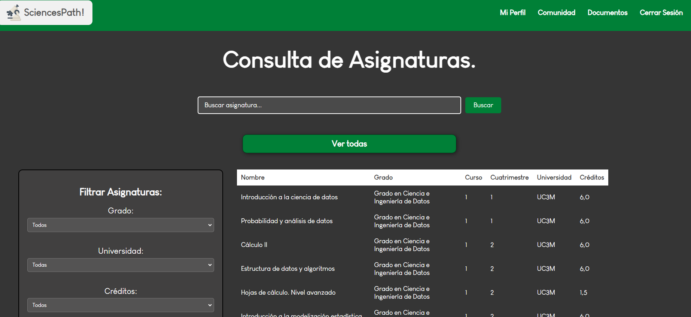

# SciencesPath 🌟

Empower your academic journey with SciencesPath, a dynamic platform designed to guide students through the 'Grado en Ciencias' program. 🚀

## Features ✨

- Discover personalized study pathways within the realm of sciences.
- Access comprehensive information about various subjects, including course details, credits, and prerequisites.
- Connect with fellow students, collaborate, and build professional networks.
- Plan your academic schedule with the built-in timetable creator.
- Get recommendations tailored to your interests and preferences.
- Explore FAQs, scholarship information, and career guidance.

## Technologies Used 🛠️

- Django Framework
- HTML5, CSS3, JavaScript
- PostgreSQL Database
- Heroku for deployment: coming soon.

## Screenshots 📷

## Getting Started 🚀

1. Clone the repository: `git clone https://github.com/PabloGradolph/SciencesPath.git`
2. Install dependencies: `pip install -r requirements.txt`
3. Configure your database settings in `settings.py`.
4. Apply migrations: `python manage.py migrate`
5. Run the development server: `python manage.py runserver`

## Contributing 👥

Contributions are welcome! Feel free to open issues and submit pull requests.

## License 📜

This project is licensed under the [MIT License](https://github.com/PabloGradolph/SciencesPath/blob/main/LICENSE).

---

Created as a Thesis Project by [Pablo Gradolph Oliva](https://github.com/PabloGradolph) | © 2023

